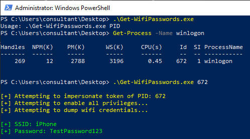

## Get-WifiPasswords

Get-WifiPasswords is a simple C# application that will recover the plaintext WiFi passwords from a target machine. Token Impersonation is utilised to execute the process as SYSTEM, necessary to access the data protection API and decrypt the encrypted passwords.

## Usage

```shell
PS C:\Users\consultant\Desktop>.\Get-WifiPasswords.exe

Usage: .\Get-WifiPasswords.exe PID

```



